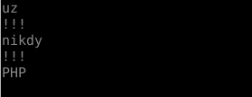

## Prvni ukol

Prvni ukol bude prochazka ruzovym sadem :)

### print

1. Pomoci funkce print vypiste slova "Python", "je", "nejlepsi", tak aby kazde slova
byla oddelena tremi vykricniky a slovo "nejlepsi" tim koncilo. JEDNIM volanim printu.
viz. Materialy

2. Vypiste slova "uz", "nikdy", "PHP", tak aby kazde bylo na vlastnim radku a mezi nimi 
byly tri vykricniky. Tzn. vystup bude vypadat nejak takto 
  
opet JEDNIM volanim printu!

### if - elif - else - for - while

1. Vytvorte si pole alespon 10 sudych i lichych cisel a do 2 novych poli ulozte zvlast suda
zvlast licha. 
To same zopakujte pomoci cyklu while. Pripominam: len(pole) vraci jeho velikost.
Pole po ukonceni cyklu vypiste. Hezky po jednom a zase jednou forem a podruhe whilem.

2. Napiste program, ktery uzivatele pozada o zadani 2 celych cisel, program potom vypocita
a vypise soucet mezi temito cisly VCETNE.
Predpokladame, ze prvni cislo je mensi nez druhe. Zkontrolujte to a pokud tak nebude, tak 
vynadejte uzivateli.
[Uzivatelsky vstup](https://docs.python.org/3/library/functions.html#input)

3. Napiste program, ktery bude po uzivateli chtit zadavat cela cisla , po kazdem inputu vypise
aktualni soucet vsech cisel ve tvaru "Aktualni soucet je: xy" (formatovani str).
Pokud bude zadano zaporne cislo, tak vynadate uzivateli a pozadate ho nove cislo.
Pokud zada uzivatel cislo 0, tak program vypise aktualni soucet a ukonci se.
Hint: int("1") == 1 

### Obecny ukol

Mrknete do slozky materialy a podivejte se na metody listu a dictu. Vyzkousejte si je
a pokud budou JAKEKOLIV nejasnosti, tak piste nebo na pristi hodine je probereme.

### Pro fajnsmekry

1. zkuste najit na internet list nebo dict comprehension a nastudujte si to.
Je to specialitka a Pythonu a jiste pochopite uzitecnost tohoto zapisu.

2. K-M-P algoritmus. Tento algoritmus slouzi k vyhledavani substringu ve stringu.
Implementujte tento algoritmus v Pythonu.  
vstup1: string ve kterem budeme hledat
vstup2: substring ktery hledame
vystup: "Nasel jsem xy vyskytu substringu: xy na indexech: xyz"  
Zde pridavam linky na pocteni o K-M-P  
[matfyz](http://www.ms.mff.cuni.cz/~kopecky/vyuka/dis/02/dis02_v3.html)  
[en wiki](https://en.wikipedia.org/wiki/Knuth%E2%80%93Morris%E2%80%93Pratt_algorithm)  
[youtube](https://www.youtube.com/watch?v=GTJr8OvyEVQ)