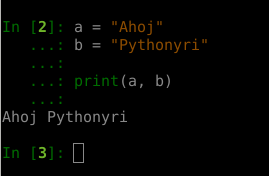

##  print(*objects, sep=' ', end='\n', file=sys.stdout, flush=False)

Jak jsme si na dnesni hodine rekli, tak print je "vypisovaci" funkce.

```python
print("Hello world!")
```


```python
a = "Ahoj"
b = "Pythonyri"

print(a, b)
```



Jak vidime, tak defaultne nam print oddeluje jednotlive promenne mezerou, 
ale co kdyz si reknu, ze to tak nechci?

Mame k tomu krasny parametr "sep".

```python
a = "Ahoj"
b = "Pythonyri"

print(a, b, sep=":-)")

```


Defaultne nam Python kazdy print ukoncuje znakem "\n" - newline.
Printu toto nastaveni muzeme menit parametrem "end".

```python
print("Ahoj", end="")  #  ukoncuj print prazdnym stringem
print("Pythonyri")  #  ukoncuj defaultne
print("Jak se mate?", end=":-)\n")
```


Poslednim parametrem je "file", blize se s nim seznamime na cviceni "Prace se soubory".

[Dokumentace](https://docs.python.org/3/library/functions.html#print)