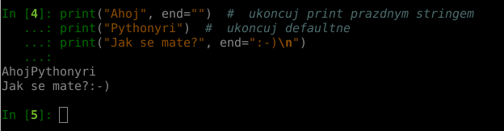

##  print(*objects, sep=' ', end='\n', file=sys.stdout, flush=False)

`print` is a function used to create output to your console

```python
print("Hello world!")
```


```python
a = "Ahoj"
b = "Pythonyri"

print(a, b)
```


By default variables are separated by a single space, but we can specify 
a different separator.

To do so, we have a parameter `sep`

```python
a = "Ahoj"
b = "Pythonyri"

print(a, b, sep=":-)")

```


By default, every print is ended with a newline character `\n`, but we can specify
a different print ending.

Change this setting using parameter `end`

```python
print("Ahoj", end="")  #  ukoncuj prazdym stringem
print("Pythonyri")  #  ukoncuj defaultne
print("Jak se mate?", end=":-)\n")
```



Last parameter if `file`, we will get familiar with it on lesson "Work with files"

[Dokumentace](https://docs.python.org/3/library/functions.html#print)